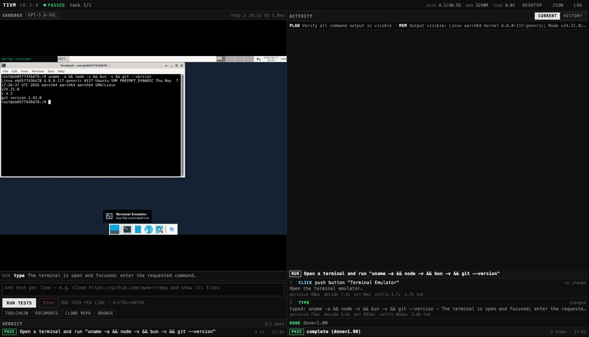
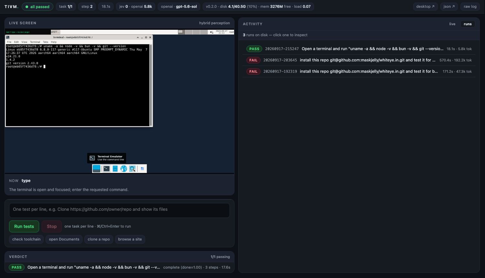

# TiVM

[](LICENSE)
[](#install)
[](https://docs.typesafe.ai)

**Computer-use test agent for a disposable Linux desktop ("dev box").** Give it a task in plain
English — it opens apps, types commands, installs repositories, runs dev servers and clicks
through the UI. The screen is read through the **AT-SPI accessibility tree** (not pixels),
decisions come from a **GPT planner** that writes shell commands or from **TypeSafe Jev** typed
questions, and actions run through accessibility `invoke` or `xdotool`. Every run starts from a
clean box; verdicts and screenshots are exported before teardown.


*Control panel: live desktop with the chosen target boxed, task/step chrome, the orchestrator's
plan and memory, per-step timeline, and per-task verdicts with failure detail.*


*Run history: every completed suite is exported to `runs/<id>/` and can be reopened here with its
timeline, verdicts, token usage and artifacts.*

---

## Contents

- [Install](#install) · [Configure keys](#configure-keys) · [Run](#run) · [Access](#access)
- [Running tests](#running-tests) · [What happens during a run](#what-happens-during-a-run)
- [Verdicts and artifacts](#verdicts-and-artifacts) · [Dev box lifecycle](#dev-box-lifecycle)
- [Configuration](#configuration) · [Troubleshooting](#troubleshooting)
- [Architecture](docs/ARCHITECTURE.md) · [Hosted service plan](docs/HOSTED.md) · [Contributing](CONTRIBUTING.md) · [Prior art](#prior-art)

## Install

Requirements: Docker CLI + a Linux VM. On macOS that is [colima](https://github.com/abiosoft/colima)
(free, no Docker Desktop needed). On Linux, plain Docker works — skip `make vm`.

```sh
# macOS
brew install colima docker docker-compose
make vm            # 2 vCPU / 4 GB RAM / 40 GB disk VM (one time)

# Linux: just make sure docker + compose are installed and the daemon runs

make up            # builds the dev-box image and starts it (~6-8 min the first time)
```

`make up` always starts fresh (removes the old box, prunes dangling layers, rebuilds if needed).
`make status` (or `make boxes`) shows the VM, containers, images and disk usage at any time.

## Configure keys

Copy the example file and fill in at least one key:

```sh
cp .env.example .env
```

| key | needed for | notes |
| --- | ---------- | ----- |
| `OPENAI_API_KEY` | the default planner (`TIVM_PLANNER=openai`) | screenshot → JSON action; can write shell commands |
| `TYPESAFE_API_KEY` | the alternative planner (`TIVM_PLANNER=jev`) | typed questions only; needs credits on the org or every step returns HTTP 402 |

`.env` is git-ignored: **never commit real keys**. The container reads it through
`docker compose`'s `env_file`, nothing is baked into the image.

## Run

```sh
make up        # start the dev box (idempotent; always fresh)
make down      # stop it
make logs      # follow container logs
```

## Access

| what | URL |
| ---- | --- |
| Control panel (type tests, watch decisions) | http://localhost:6081 |
| Desktop, live in the browser (noVNC) | http://localhost:6080/vnc.html?autoconnect=1&resize=scale |
| Verdict JSON of the current/last run | http://localhost:6081/api/result |
| Raw log | panel header → **Log** |

Ports are published on `0.0.0.0`, so another device on the same network can use
`http://<your-ip>:6081` and `http://<your-ip>:6080/vnc.html?autoconnect=1&resize=scale`.
**There is no auth by default** — set `TIVM_TOKEN` (see [Configuration](#configuration)) before
exposing the panel beyond your machine.

## Running tests

Type one test per line in the panel and press **Run tests** (⌘/Ctrl+Enter). Each line is an
independent test case with its own verdict.

```
Open a terminal and run "uname -a && node -v && bun -v"
Clone https://github.com/owner/repo and show its files
Open the file manager and open the "Documents" folder
```

Nothing runs until you trigger it. From CI or a script, the same thing over HTTP:

```sh
curl -X POST localhost:6081/api/run \
  -H 'Content-Type: application/json' \
  -d '{"tasks": ["Open a terminal and run \"bun --version\""]}'
```

With `TIVM_TOKEN=secret`: add `-H 'Authorization: Bearer secret'`.

## What happens during a run

```
perceive (a11y + optional OCR) → one planner call → act → settle → repeat
```

- **Perceive** — walk the AT-SPI tree (~50 ms): real widgets with role, name, coordinates,
  focus and values. Off-screen nodes are filtered. OCR (tesseract) or OpenAI vision can be
  enabled as a fallback for surfaces a11y cannot see.
- **Decide** — one call to the planner with the screenshot (OpenAI) or typed questions (Jev).
  The planner is an orchestrator with memory: it maintains a `plan`, a `memory` string and a
  self-`check` for each action, all carried across steps so it stays on task.
- **Act** — accessibility `invoke` when the widget supports it (no mouse), otherwise `xdotool`.
  Typing presses Return by default; empty targets are refused with corrective feedback.
- **Settle** — poll until the frame stops changing (0.35 s min, up to 10 s after commands).

Guards: `done`/`blocked` from the planner, 4 identical actions, 4 no-change actions, 20
consecutive waits, Stop. Steps are **unlimited by default** (`TIVM_MAX_STEPS=0`).

## Verdicts and artifacts

Each task ends with `PASS`/`FAIL` and a reason. A failed task never stops the suite — remaining
tasks still run, and the final verdict is the aggregate (e.g. `1/2 passing`).

Failures carry the full story (panel, `/api/result` and the JSON artifacts):

```json
{
  "task": "Open the file manager and open the \"NONEXISTENT\" folder",
  "passed": false,
  "reason": "blocked: an error, auth prompt or missing target prevents progress",
  "failure": {
    "stage": "decide",          // decide | act | settle | wait | limit | error
    "step": 4,
    "action": "type",           // what it was doing
    "target_text": null,        // where
    "typed": "root/Documents",
    "check": "the folder opens",
    "focused_window": "File System - Thunar",
    "screen": "…terminal tail…",
    "elements": ["File", "Edit", "View", "Documents", "Downloads", "…"]
  }
}
```

Every finished suite is exported to the host:

```
runs/<timestamp>/run.json            suite summary + per-task results (failures included)
runs/<timestamp>/task-N.json         verdict, steps, tokens, duration, failure
runs/<timestamp>/task-N-final.jpg    annotated final screen
runs/<timestamp>/task-N.mp4          video of the whole task
runs/<timestamp>/task-N-failure.mp4  last seconds before a failed verdict
runs/<timestamp>/screen.mp4          full-suite recording (source of the task clips)
runs/<timestamp>/report.html         shareable report: verdicts, videos, failure story
runs/<timestamp>/timeline.json       every step: action, reason, check, timings, tokens
```

The report is also reachable live at `http://localhost:6081/runs/<id>/report.html`
(or `/api/runs/<id>/report`, which regenerates it). `TIVM_VIDEO=0` turns recording off.

`make runs` lists them, `make wipe-runs` deletes them, `TIVM_KEEP_RUNS` (default 20) auto-prunes.

## Dev box lifecycle

One running sandbox = one **dev box** (container inside the colima VM). Nothing survives a start:
repos, installs, caches and browser profiles are wiped by the entrypoint on every boot, so runs
never inherit state.

| command | what it does |
| ------- | ------------ |
| `make boxes` | list dev boxes: containers, VM, disk footprint |
| `make kill` | stop/remove boxes, prune images (keeps `./runs` artifacts) |
| `make nuke` | kill boxes + delete the VM → reclaims RAM and ~GBs of disk |
| `make clean` | prune dangling images and build cache |

## Configuration

All settings live in `agent/config.py` with env-var overrides; the ones you are likely to touch:

| variable | default | meaning |
| -------- | ------- | ------- |
| `TIVM_PLANNER` | `openai` | `openai` (sees pixels, writes commands) or `jev` (cheap, text-only) |
| `TIVM_OPENAI_PLANNER_MODEL` | `gpt-5.6-sol` | planner model |
| `TIVM_OPENAI_REASONING_EFFORT` | `none` | keep it non-reasoning for speed/cost |
| `TIVM_OPENAI_VISION_MODEL` | `gpt-5.6-sol` | model for `TIVM_PERCEPTION=vision` |
| `TIVM_PERCEPTION` | `hybrid` | `hybrid` (a11y + tesseract for Jev) · `a11y` · `vision` |
| `TIVM_MAX_STEPS` | `0` | 0 = unlimited; cap per run via the API if you want a budget |
| `TIVM_TOKEN` | empty | bearer token required on `/api/run` and `/api/stop` |
| `TIVM_KEEP_RUNS` | `20` | artifact folders kept on disk |
| `SCREEN_W` / `SCREEN_H` | `1280` / `800` | dev box resolution |

The full list (waits, settle timings, thresholds, OCR scale, retries) is in
[`agent/config.py`](agent/config.py). The HTTP API is documented in
[docs/ARCHITECTURE.md](docs/ARCHITECTURE.md#http-api).

## Troubleshooting

| symptom | fix |
| ------- | --- |
| `error creating lima disk: disk 'colima' already exists` | `make nuke` (clears `~/.colima/_lima/_disks`), then `make vm && make up` |
| `Bind for 0.0.0.0:6080 failed: port is already allocated` | another dev box is running: `make boxes`, then `make kill` or `make down` |
| noVNC shows "disconnected" | the container restarted; `make up` brings it back (~20 s, no rebuild) |
| every Jev step returns HTTP 402 | the TypeSafe org has no credits — top up or switch to `TIVM_PLANNER=openai` |
| first browser task clicks a privacy notice | expected once per box; the agent dismisses it |
| panel unreachable after a VM restart | `make up`; check `make status` |
| builds feel slow / disk filling | `make clean` (prunes images + build cache), `TIVM_KEEP_RUNS=5` |

## Prior art

[awlevin/typesafe-computer-use](https://github.com/awlevin/typesafe-computer-use) does the same
OCR + classifier loop on macOS and is well worth reading. Differences here: Linux + AT-SPI as the
primary perception path, a11y `invoke` instead of synthetic clicks, disposable Docker dev boxes,
and a planner with plan/memory/self-check.

## License

MIT — see [LICENSE](LICENSE).
